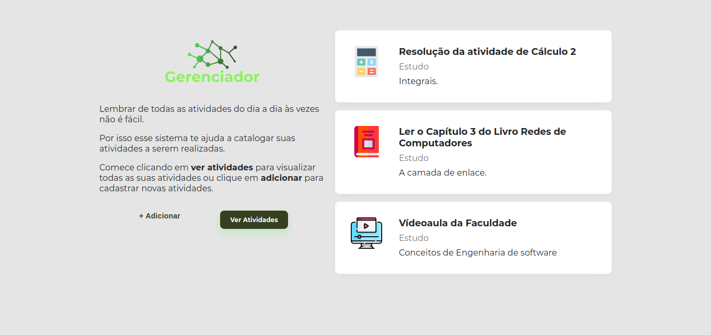
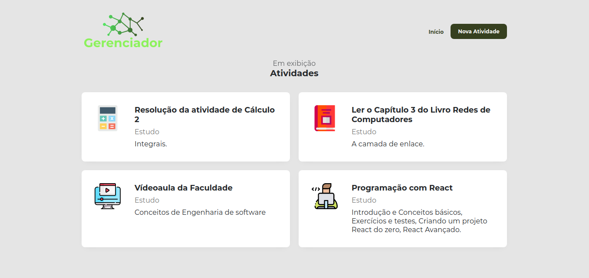
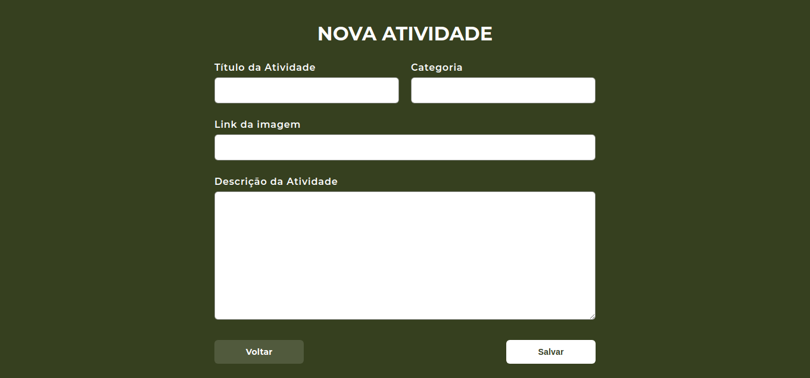

# Catalogo-Tarefas
Página web criada com HTML, CSS e Javascript para catalogar atividades a serem realizadas no dia a dia.

Foram utilizados express, nunjucks, nodemon, SQLite, node.js.

## Demonstrativo do site

